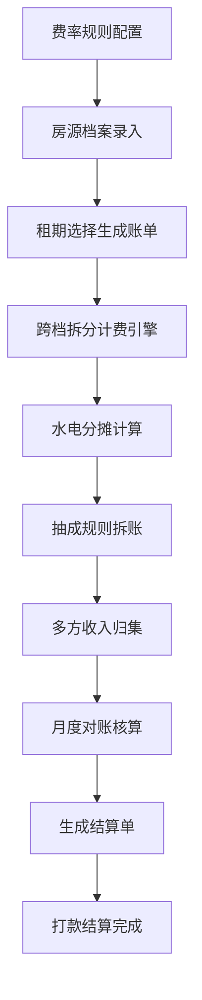

## 1. 产品概述

长租公寓收租管理系统是一款面向长租公寓运营方的纯前端应用，解决分时段差异化计费、跨季节分段结算、平台与房东多方分账、月度对账核算等核心业务痛点。通过自动化计费与分账引擎，大幅降低人工核算成本，提升财务结算准确度。

## 2. 核心功能

### 2.1 用户角色
| 角色 | 注册方式 | 核心权限 |
|------|----------|----------|
| 运营管理员 | 本地登录 | 费率配置、房源管理、账单生成、分账规则设置、月度对账全权限 |
| 财务人员 | 本地登录 | 账单查看、分账明细、对账核算、报表导出 |
| 房东视图 | 本地登录 | 查看房源收入明细、结算记录 |

### 2.2 功能模块
1. **分时段计费模块**：计费规则配置、时段费率表维护、跨季节切换点配置、跨档时长拆分算法
2. **账单生成模块**：租期选择、房源关联、租金自动计算、水电分摊计费、费用明细展示
3. **抽成分账模块**：抽成比例配置、平台/房东/物业多方拆分、收入归集汇总、分账明细导出
4. **对账结算模块**：月度账单归集、账期对比、异常标记、多方应结金额核算、结算状态管理

### 2.3 页面详情
| 页面名称 | 模块名称 | 功能描述 |
|-----------|-------------|---------------------|
| 总览仪表盘 | 数据概览 | 本月收入统计、在租房源数、待结算金额、分账趋势图 |
| 分时段计费 | 费率规则配置 | 季节时段定义（旺季/平季/淡季）、切换日期、各档日/月租单价配置 |
| 分时段计费 | 费率表维护 | 房源与费率绑定、批量导入、历史版本管理 |
| 分时段计费 | 跨档拆分演示 | 可视化展示租期跨越多个季节节点时的分段计费明细 |
| 账单管理 | 账单列表 | 账单查询、筛选、状态流转（待生成/已生成/已确认） |
| 账单管理 | 账单生成器 | 选择房源+租期区间，自动调用计费引擎生成明细，支持手动调整 |
| 账单管理 | 水电分摊 | 抄表录入、按户型/人数/面积分摊规则、公摊费用计算 |
| 抽成分账 | 分账规则 | 平台抽成比例、物业服务费、房东结算比例配置，支持按房源差异化 |
| 抽成分账 | 分账明细 | 单笔账单拆分明细展示，多方（平台/房东/物业）收入归集统计 |
| 对账结算 | 月度对账 | 按月份聚合所有账单，生成各方应结总额，支持对账差异标记 |
| 对账结算 | 结算单管理 | 结算单生成、审批流转、打款状态追踪 |
| 房源管理 | 房源档案 | 房源基础信息、户型、面积、绑定费率、绑定分账规则 |

## 3. 核心流程

### 3.1 主业务流程
1. 管理员配置季节时段及各档费率 → 2. 录入房源档案并绑定费率与分账规则 → 3. 选择房源+租期生成账单（系统自动跨档拆分计算）→ 4. 录入水电抄表数据并分摊 → 5. 系统按抽成规则自动拆分为平台/房东/物业三方 → 6. 月底归集当月所有账单 → 7. 对账核算后生成结算单 → 8. 完成打款结算

### 3.2 跨档拆分算法流程

## 4. 用户界面设计

### 4.1 设计风格
- **主色调**：深墨绿 `#0F3D2E`（稳重可靠）+ 琥珀金 `#C8A96B`（高端质感）
- **辅助色**：暖米白 `#F5F1E8` 背景，苔藓绿 `#4A7C59` 成功态，珊瑚橙 `#E07A5F` 警告态
- **按钮风格**：微圆角（6px）、微妙阴影、hover 时轻微上浮 2px + 阴影加深
- **字体方案**：标题用「思源宋体 CN」体现专业厚重，正文用「Inter」保障数字可读性
- **布局风格**：左侧 240px 深色导航栏 + 右侧卡片式内容区，数据表格配斑马纹
- **图标风格**：线性 Lucide 图标，关键数据配小巧 SVG 装饰图形

### 4.2 页面设计概览
| 页面名称 | 模块名称 | UI 元素 |
|-----------|-------------|-------------|
| 总览仪表盘 | 数据概览 | 4张统计卡片（深绿底+金箔数字）、趋势折线图、最近账单流水表、渐变色块装饰 |
| 费率配置 | 季节时间轴 | 可视化时间轴展示全年季节分布、拖拽式切换点调整、费率输入卡片组 |
| 账单生成器 | 计算面板 | 左栏表单（房源/日期选择器），右栏实时计算结果（分段明细+合计），金箔色高亮总计 |
| 分账明细 | 拆分卡片 | 三段式环形进度图展示三方占比、数字动画、明细表格配深浅行区分 |
| 月度对账 | 对账总表 | 月份选择器、可折叠分组（按房源/按房东）、差异行红底高亮、结算按钮固定底栏 |

### 4.3 响应式
桌面优先（1440px 基准），侧边栏在 < 1024px 时折叠为汉堡菜单，表格在移动端支持横向滚动，关键数字始终保持大号展示。

### 4.4 数据可视化
- 跨档拆分：横向堆叠条形图，不同颜色代表不同季节费率段
- 分账比例：甜甜圈图，三片区分别对应平台/房东/物业
- 月度趋势：面积图，叠加展示总收入与各方净收入
