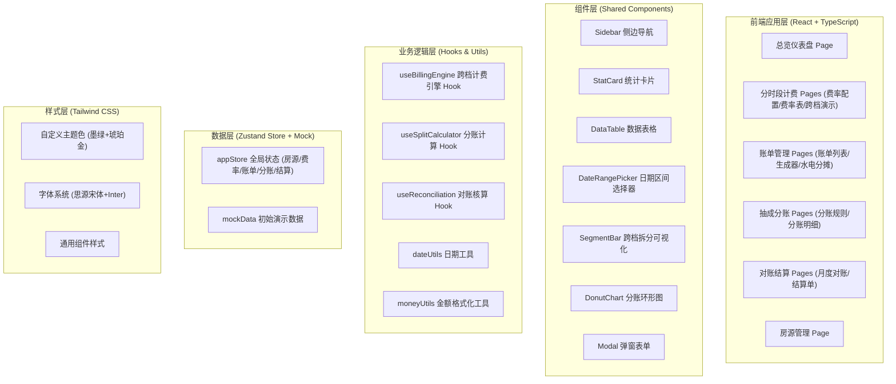
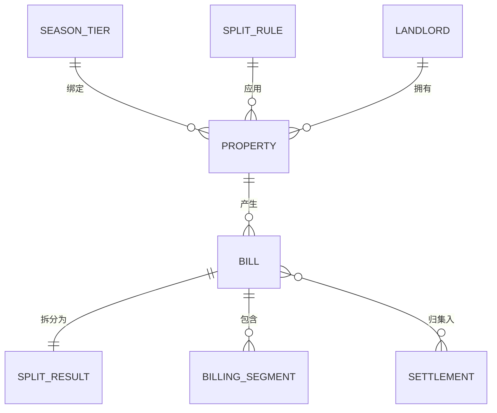

## 1. 架构设计



## 2. 技术描述
- **前端框架**: React@18 + TypeScript + Vite
- **初始化工具**: vite-init (react-ts 模板)
- **路由**: react-router-dom@6
- **状态管理**: zustand@4
- **样式方案**: tailwindcss@3 + 原生 CSS 变量
- **图标库**: lucide-react
- **图表**: 原生 SVG 实现轻量图表（不依赖第三方图表库，保持纯前端轻量）
- **后端**: 无（纯前端应用，Mock 数据 + localStorage 持久化）
- **数据存储**: localStorage 存储用户配置数据，初始内置演示 Mock 数据

## 3. 路由定义
| Route | 页面 | 核心功能 |
|-------|------|----------|
| `/dashboard` | 总览仪表盘 | 数据统计卡片、收入趋势、最近账单 |
| `/pricing/rules` | 费率规则配置 | 季节时段定义、切换点、各档费率 |
| `/pricing/rates` | 费率表维护 | 房源-费率绑定表、批量操作 |
| `/pricing/split-demo` | 跨档拆分演示 | 可视化分段计费演示 |
| `/bills/list` | 账单列表 | 查询、筛选、状态管理 |
| `/bills/generator` | 账单生成器 | 租期选择+自动计费+水电录入 |
| `/bills/utilities` | 水电分摊 | 抄表录入、分摊计算 |
| `/split/rules` | 分账规则 | 抽成比例配置、多方分配方案 |
| `/split/details` | 分账明细 | 单笔拆分、多方归集汇总 |
| `/reconciliation/monthly` | 月度对账 | 按月聚合、差异标记 |
| `/reconciliation/settlements` | 结算单管理 | 结算单生成、状态追踪 |
| `/properties` | 房源管理 | 房源档案 CRUD |

## 4. API 定义（纯前端 Mock 接口，实际为 Store 方法）

```typescript
// === 类型定义 ===

// 季节费率档
interface SeasonTier {
  id: string;
  name: string;           // 旺季/平季/淡季
  color: string;          // 标识色
  startMonth: number;     // 开始月份 1-12
  startDay: number;       // 开始日期 1-31
  endMonth: number;
  endDay: number;
  dailyRate: number;      // 日单价 (元)
  monthlyRate: number;    // 月单价 (元)
}

// 房源
interface Property {
  id: string;
  name: string;
  code: string;           // 房源编号
  type: string;           // 户型 一居/两居/三居
  area: number;           // 建筑面积 ㎡
  landlordId: string;     // 关联房东
  rateTierId: string;     // 绑定费率档
  splitRuleId: string;    // 绑定分账规则
  status: 'vacant' | 'rented';
}

// 房东
interface Landlord {
  id: string;
  name: string;
  phone: string;
  bankAccount: string;
}

// 分账规则
interface SplitRule {
  id: string;
  name: string;
  platformCut: number;    // 平台抽成比例 0-1
  propertyFee: number;    // 物业服务费比例 0-1
  landlordCut: number;    // 房东所得比例 0-1 (自动 = 1 - platformCut - propertyFee)
}

// 计费分段（跨档拆分结果）
interface BillingSegment {
  tierId: string;
  tierName: string;
  startDate: string;      // YYYY-MM-DD
  endDate: string;
  days: number;
  unitPrice: number;
  amount: number;
}

// 水电抄表
interface UtilityReading {
  type: 'water' | 'electric';
  previous: number;
  current: number;
  unitPrice: number;
  usage: number;
  amount: number;
}

// 账单
interface Bill {
  id: string;
  billNo: string;
  propertyId: string;
  tenantName: string;
  startDate: string;
  endDate: string;
  segments: BillingSegment[];
  baseRent: number;       // 基础租金合计
  utilities: {
    water: UtilityReading;
    electric: UtilityReading;
    commonArea: number;   // 公摊费用
  };
  totalAmount: number;    // 应收总额
  splitResult: SplitResult;
  status: 'draft' | 'generated' | 'confirmed' | 'paid';
  createdAt: string;
}

// 分账结果
interface SplitResult {
  ruleId: string;
  totalBase: number;
  platformAmount: number;
  propertyFeeAmount: number;
  landlordAmount: number;
}

// 结算单
interface Settlement {
  id: string;
  settlementNo: string;
  period: string;         // 2025-06
  partyType: 'platform' | 'landlord' | 'property';
  partyId: string;
  partyName: string;
  billCount: number;
  totalAmount: number;
  status: 'pending' | 'approved' | 'paid';
  paidAt?: string;
}

// === Store 方法 ===
interface AppStore {
  // 费率
  seasonTiers: SeasonTier[];
  upsertSeasonTier: (tier: SeasonTier) => void;
  deleteSeasonTier: (id: string) => void;

  // 房源
  properties: Property[];
  landlords: Landlord[];

  // 分账规则
  splitRules: SplitRule[];

  // 账单
  bills: Bill[];
  generateBill: (data: GenerateBillParams) => Bill;
  confirmBill: (id: string) => void;

  // 结算
  settlements: Settlement[];
  runMonthlyReconciliation: (period: string) => Settlement[];
}
```

## 5. 数据模型（Mock 数据结构）



**初始 Mock 数据要点**:
- 3 档季节费率：旺季(6-8月) 日租180/月租4800，平季(3-5,9-11月) 日租140/月租3800，淡季(12-2月) 日租100/月租2800
- 8 套示例房源，覆盖一居/两居/三居户型
- 4 位房东
- 2 套分账规则（标准档: 平台10%+物业5%+房东85%；VIP档: 平台8%+物业3%+房东89%）
- 15+ 条历史账单数据覆盖近 3 个月
- 2 个月的已结算记录

## 6. 核心算法设计

### 6.1 跨档拆分计费算法
输入：startDate, endDate, propertyId
1. 获取房源绑定的费率集合 seasonTiers
2. 将 startDate ~ endDate 区间按年迭代（处理跨年）
3. 对每年，生成该年所有季节切换日期（含年初/年末）并排序
4. 取 [startDate, endDate] 与切换日期数组的交集点
5. 按相邻两个切换点切分子区间
6. 每个子区间匹配所属季节，计算天数 × 日单价
7. 求和得 baseRent，返回 segments[] + baseRent

### 6.2 抽成分账算法
输入：baseRent, utilities, splitRule
1. totalBase = baseRent（仅基础租金参与抽成）
2. platformAmount = totalBase × platformCut
3. propertyFeeAmount = totalBase × propertyFee
4. landlordAmount = totalBase - platformAmount - propertyFeeAmount
5. 水电和公摊: 全额计入 landlordAmount（代收代付不抽成）
6. 总租金 = baseRent + utilities.water.amount + utilities.electric.amount + utilities.commonArea

### 6.3 月度对账算法
输入：period (YYYY-MM)
1. 过滤账单: startDate 或 endDate 落在 period 内的账单
2. 对跨月账单按天比例拆分归属当期金额
3. 按 partyType (platform/landlord/property) + partyId 分组
4. 聚合每组 billCount、totalAmount
5. 生成对应 Settlement 记录
